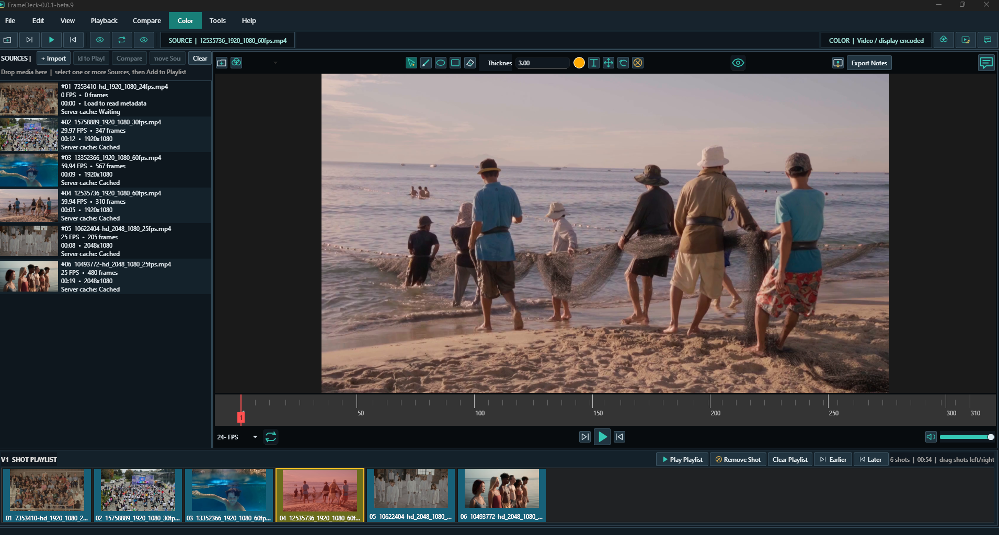

# FrameDeck



FrameDeck is a portable VFX shot-review player for Windows and Ubuntu. It is
based on [subing85/viewline](https://github.com/subing85/viewline) and extends
that project with an RV-inspired review workflow, editorial playlists, modern
color management, image-sequence playback, annotations, caching, and portable
release builds.

## Highlights

- Import multiple MP4, MOV, AVI, EXR, PNG, JPG, and JPEG sources at once.
- Build and reorder a horizontal Shot Playlist Timeline; play it on one
  continuous global frame range.
- Compare two sources using vertical/horizontal wipe, opacity overlay,
  difference, side-by-side, checkerboard, A-only, B-only, or flicker modes.
- Review EXR AOVs and numbered EXR/JPG/PNG sequences.
- OCIO project settings with bundled ACES 1.2 Legacy and built-in ACES 1.3/
  ACES 2.0 CG and Studio configs, user configs, display/view selection, and
  common camera/log presets.
- Pencil and Text notes stored per frame, with annotated-frame export.
- RV-style wheel zoom, middle-button pan, continuous right-drag zoom, and
  double-click immersive full screen while playback remains active.
- Audio playback, volume/mute controls, and synchronized playlist playback.
- Local media/proxy cache for server sources and color-aware 2K EXR previews.
- Full-resolution JPG/PNG extraction and high-quality MP4 export.
- Portable Windows build and Ubuntu AppImage release automation.

## What FrameDeck adds to Viewline

The upstream Viewline project supplied the original Python/PySide review-player
foundation. FrameDeck keeps that history and license, then adds a substantially
expanded production workflow:

### Review interface and navigation

- A redesigned graphite/navy interface inspired by professional review tools,
  with completely new application branding and icon treatment.
- A compact Sources bin, main viewer, persistent playback controls, and an
  editorial Shot Playlist Timeline that remains available in the new layout.
- Smooth wheel zoom during playback, cursor-centered zoom, middle/Alt-left pan,
  right-drag continuous zoom, Fit, and immersive full screen.
- Blank startup with no bundled test project or automatically loaded media.

### Sources, playlists, and editorial playback

- Multi-file drag/drop and import for local disks and server paths.
- Select Sources and append them to the playlist; one source may appear more
  than once.
- Horizontal drag reorder, Earlier/Later controls, deletion of individual
  playlist occurrences, and source deletion without touching original files.
- Continuous playlist playback whose frame range is the sum of every shot,
  including cross-clip scrubbing, frame stepping, and automatic advance.
- Portable `.fdplaylist` save/restore with relative paths, order, active media,
  frame position, and timeline visibility.
- Invalid or unreadable media is skipped so the remaining playlist can continue.

### Playback, media, and performance

- Long-video timeline optimization and bounded frame caches.
- 2K/4K-aware decode buffering, background sequence decode, frame prefetch, and
  persistent 2K display proxies for heavy EXR review.
- Server-media background caching with progress, configurable limits, cache
  inspection, multi-shot caching, and safe cache clearing.
- MOV thumbnail support, audio decode/output, mute and volume controls.
- MP4/MOV/AVI playback plus numbered EXR/JPG/PNG sequences and EXR AOVs.

### Color management

- User/studio OCIO config loading and project-level working space, input,
  display, view, and per-file-type defaults.
- Bundled offline ACES 1.2 Legacy plus OCIO built-in ACES 1.3 and ACES 2.0 CG/
  Studio configurations.
- Film/VFX presets for ACES2065-1, ACEScg, ACEScct, Rec.709, ARRI LogC3/4,
  Sony S-Log3, RED Log3G10, Blackmagic Film Gen 5, and Raw/data viewing.
- Correct float-before-display processing, independent RGB/RGBA handling,
  alpha preservation, data-AOV bypass, explicit Raw mode, and color-aware proxy
  invalidation.
- Independent OCIO processors for the A and B sources in comparison mode.

### Comparison and annotations

- Synchronized A/B review with vertical/horizontal wipe, opacity overlay,
  difference, side-by-side, checkerboard, A-only, B-only, and flicker modes.
- Per-frame Pencil and Text annotations, Navigate/Esc tool exit, undo/erase,
  and export of all annotated frames.

### Export and delivery

- Full-resolution JPG/PNG extraction from the current display view.
- High-quality MP4 conversion from movies or image sequences, preserving movie
  FPS/audio and allowing user-defined image-sequence FPS.
- PyInstaller-based Windows portable packaging and Ubuntu AppImage packaging.
- GitHub Actions builds and publishes both portable formats from one release.

## Download

Download portable builds from the
[GitHub Releases](https://github.com/D-Mad/FrameDeck/releases) page.

Windows users extract the complete ZIP and double-click `FrameDeck.exe`.
Ubuntu users mark the AppImage executable and run it directly.

## Keyboard and mouse

| Input | Action |
| --- | --- |
| Space | Play / pause |
| Left / Right | Previous / next frame |
| Mouse wheel | Zoom at pointer |
| Middle drag | Pan |
| Right drag | Continuous zoom |
| Double-click viewer / F11 | Toggle immersive full screen |
| F | Fit image |
| Esc | Exit full screen or annotation mode |
| Alt+Left / Alt+Right | Reorder selected playlist shot |
| Ctrl+Shift+S / Ctrl+Shift+O | Save / open `.fdplaylist` |

## Build from source

Detailed instructions are available in [README_WINDOWS.md](README_WINDOWS.md)
and [README_UBUNTU.md](README_UBUNTU.md).

```powershell
# Windows
.\build-windows.ps1
```

```bash
# Ubuntu 22.04+
bash build-ubuntu-appimage.sh
```

## Attribution and license

FrameDeck retains the original Viewline Git history and Apache-2.0 license.
See [LICENSE](LICENSE). The bundled ACES 1.2 archive source and checksum are
documented in `resources/ocio/ACES_1.2_SOURCE.txt`.
